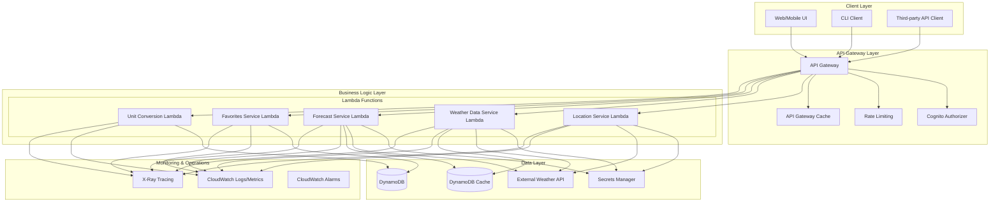

# Design Document: Serverless Weather App

## Overview

The Serverless Weather App is a cloud-native application built on AWS that provides weather information through a REST API. The application follows AWS Well-Architected Framework principles and implements hexagonal architecture patterns for maintainability and scalability. The system retrieves weather data from external providers (OpenWeather/WeatherAPI), stores user favorites in DynamoDB, and implements caching strategies to optimize external API usage while maintaining responsive performance.

### Key Design Decisions

1. **Serverless Architecture**: All components run on AWS Lambda with API Gateway, eliminating server management overhead and enabling automatic scaling.
2. **Hexagonal Architecture**: Separation of business logic from infrastructure concerns using ports and adapters pattern for testability and maintainability.
3. **Multi-Layer Caching**: Implement caching at multiple levels (API Gateway, Lambda, DynamoDB) to reduce external API calls and costs.
4. **Secure Secrets Management**: API keys stored in AWS Secrets Manager with automatic rotation and least-privilege access.
5. **Cost Optimization**: Aggressive caching, request consolidation, and efficient data models to minimize external API calls and DynamoDB operations.

## Correctness Properties

*A property is a characteristic or behavior that should hold true across all valid executions of a system-essentially, a formal statement about what the system should do. Properties serve as the bridge between human-readable specifications and machine-verifiable correctness guarantees.*

**Property 1: Never Exceed 50 Favorites**
*For any* user and *any* sequence of operations, the Favorites Service SHALL never allow a user to have more than 50 favorite locations simultaneously.
**Validates: Requirements 5.1, 5.2**

**Property 2: Never Return Invalid Temperature Unit**
*For any* temperature display operation, the system SHALL never display temperatures in units other than Celsius or Fahrenheit.
**Validates: Requirements 6.3**

**Property 3: Never Cache Data Beyond TTL**
*For any* cached weather data entry, the system SHALL never serve data older than its configured TTL (15 minutes for current conditions, 1 hour for forecasts).
**Validates: Requirements 2.5, 3.1, 3.2**

**Property 4: Never Modify Data on Search Failure**
*For any* location search operation that fails due to timeout or external service error, the system SHALL never modify the currently displayed location.
**Validates: Requirements 1.5**

**Property 5: Eventually Complete Location Search**
*For any* valid location search query (≥2 non-whitespace characters), the system SHALL eventually return results or an error response within 5 seconds.
**Validates: Requirements 1.1, 1.4**

**Property 6: Eventually Provide Current Conditions**
*For any* selected location, the system SHALL eventually display current weather conditions within 5 seconds of selection.
**Validates: Requirements 1.3**

**Property 7: Eventually Detect Device Location**
*For any* user who grants location permission, the system SHALL eventually determine and display nearest weather location within 30 seconds.
**Validates: Requirements 4.1**

**Property 8: Eventually Update Temperature Units**
*For any* temperature unit change operation, the system SHALL eventually update all displayed temperature values within 1 second.
**Validates: Requirements 6.2**

**Property 9: Query Length Validation Invariant**
*For all* location search operations, queries with fewer than 2 non-whitespace characters SHALL always be rejected without external API calls.
**Validates: Requirements 1.2**

**Property 10: Temperature Range Invariant**
*For all* temperature display operations, converted temperature values SHALL always preserve physical temperature relationships (freezing point at 0°C/32°F, etc.).
**Validates: Requirements 6.1**

**Property 11: Forecast Order Invariant**
*For all* forecast display operations, hourly forecasts SHALL always be displayed in chronological order for the next 24 hours, and daily forecasts SHALL always be displayed in chronological order for the next 7 days.
**Validates: Requirements 3.3, 3.4**

**Property 12: Humidity Range Invariant**
*For all* humidity display operations, humidity values SHALL always be displayed as percentages between 0 and 100 inclusive.
**Validates: Requirements 2.3**

**Property 13: Empty Result Set Behavior**
*For any* location search query (≥2 non-whitespace characters) that matches no locations, the system SHALL return an empty result set and display "no results found".
**Validates: Requirements 1.4**

**Property 14: Duplicate Favorite Behavior**
*For any* attempt to save a location that is already a favorite, the system SHALL make no change to the favorites list and retain a single entry.
**Validates: Requirements 5.7**

**Property 15: Refresh Timeout Behavior**
*For any* refresh operation that does not complete within 5 seconds, the system SHALL cancel the request, display a timeout error, and retain previously displayed data.
**Validates: Requirements 7.3**

**Property 16: Forecast Failure Behavior**
*For any* forecast retrieval that fails (timeout or service error), the system SHALL display an error for the forecast section while continuing to display available current conditions.
**Validates: Requirements 3.5, 3.6**

**Property 17: Device Location Fallback**
*For any* device location detection that fails within 30 seconds or finds no location within 50km, the system SHALL display an error and provide manual search input.
**Validates: Requirements 4.4**

**Property 18: Favorite Temperature Fallback**
*For any* favorite location whose current temperature cannot be retrieved within 5 seconds, the system SHALL display the favorite with temperature unavailable indication while retaining it in the list.
**Validates: Requirements 5.5**

**Property 19: Unit Preference Persistence Fallback**
*For any* temperature unit preference that fails to persist, the system SHALL retain the selected unit for the current session and display a save error indication.
**Validates: Requirements 6.6**

**Property 20: Location Search Latency**
*For all* valid location searches, response time SHALL be ≤5 seconds with 99.9% success rate.
**Validates: Requirements 1.1**

**Property 21: Current Conditions Latency**
*For all* location selections, current conditions SHALL be displayed within ≤5 seconds with 99.9% success rate.
**Validates: Requirements 1.3, 2.1**

**Property 22: Forecast Retrieval Latency**
*For all* location selections, hourly and daily forecasts SHALL be retrieved within ≤10 seconds.
**Validates: Requirements 3.1, 3.2**

**Property 23: Favorite Temperature Latency**
*For all* favorite locations in the list, current temperatures SHALL be retrieved within ≤5 seconds per location.
**Validates: Requirements 5.4**

**Property 24: Refresh Operation Latency**
*For all* refresh operations, updated data SHALL be retrieved within ≤5 seconds.
**Validates: Requirements 7.1**

**Property 25: Lambda Cold Start Invariant**
*For all* Lambda function invocations after a cold start, initialization SHALL complete within the configured timeout (10-30 seconds) without service disruption.
**Validates: Requirements 8.1**

**Property 26: DynamoDB Consistency**
*For all* favorite operations (add/remove/list), DynamoDB SHALL provide eventually consistent reads with strong consistency for immediate subsequent reads of the same item.
**Validates: Requirements 8.2**

**Property 27: Secrets Manager Security**
*For all* external API calls, API keys SHALL be retrieved from AWS Secrets Manager with automatic rotation every 90 days and never exposed in logs or responses.
**Validates: Requirements 8.3**

**Property 28: API Gateway Caching**
*For all* identical API requests within the cache TTL (5 minutes), API Gateway SHALL return cached responses without Lambda invocation.
**Validates: Requirements 8.4**

**Property 29: CloudWatch Logging Completeness**
*For all* system operations, complete execution traces SHALL be logged to CloudWatch with structured JSON format and correlation IDs.
**Validates: Requirements 8.5**

### Testing Strategy for Correctness Properties

Since PBT is not applicable, these correctness properties will be validated through:

1. **Integration Tests**: For properties involving external services and AWS infrastructure
2. **Unit Tests**: For pure business logic properties (validation, conversion, etc.)
3. **Contract Tests**: For external API integration properties
4. **Performance Tests**: For timing guarantee properties
5. **Monitoring and Alerts**: For operational properties (AWS-specific guarantees)

Each test will reference the specific property it validates using the annotation format: **Validates: Property {number}**

## Architecture

### High-Level Architecture Diagram



### Hexagonal Architecture Implementation

The application follows hexagonal architecture (ports and adapters) pattern:

```
┌─────────────────────────────────────────────────────────────┐
│                    Application Core                          │
│  ┌─────────────────────────────────────────────────────┐    │
│  │              Domain Models & Business Logic         │    │
│  │  • Location, WeatherData, Forecast, Favorite        │    │
│  │  • Validation rules, business rules, unit conversion│    │
│  └─────────────────────────────────────────────────────┘    │
│                                                              │
│  ┌─────────────┐  ┌─────────────┐  ┌─────────────┐         │
│  │   Ports     │  │   Ports     │  │   Ports     │         │
│  │ (Interfaces)│  │ (Interfaces)│  │ (Interfaces)│         │
│  └─────────────┘  └─────────────┘  └─────────────┘         │
│         │              │              │                     │
│  ┌─────────────┐  ┌─────────────┐  ┌─────────────┐         │
│  │  Adapters   │  │  Adapters   │  │  Adapters   │         │
│  │ (Implementa-│  │ (Implementa-│  │ (Implementa-│         │
│  │   tions)    │  │   tions)    │  │   tions)    │         │
│  └─────────────┘  └─────────────┘  └─────────────┘         │
└─────────────────────────────────────────────────────────────┘
         │              │              │
┌────────┴──────────────┴──────────────┴────────┐
│           Infrastructure & External            │
│  • AWS Lambda, API Gateway, DynamoDB          │
│  • External Weather APIs                      │
│  • Secrets Manager, CloudWatch                │
└───────────────────────────────────────────────┘
```

### AWS Service Mappings

| Service | Purpose | Configuration |
|---------|---------|---------------|
| **API Gateway** | REST API endpoint, request routing, caching, rate limiting | REST API with Lambda proxy integration, 5-minute cache TTL, 1000 RPS rate limit |
| **Lambda** | Business logic execution | Python 3.12, 512MB memory, 10-second timeout for external calls, 30-second max timeout |
| **DynamoDB** | User favorites storage, weather data caching | On-demand capacity, TTL for cache entries (15 minutes), GSI for user queries |
| **Secrets Manager** | External API key storage | Automatic rotation every 90 days, least-privilege access via IAM roles |
| **CloudWatch** | Logging, monitoring, metrics | Structured JSON logging, custom metrics for API usage, 5-minute alarm evaluation |
| **X-Ray** | Distributed tracing | Enabled for all Lambda functions, 1% sampling rate |
| **Cognito** | User authentication (optional) | JWT token validation, user pools for multi-user scenarios |

## Components and Interfaces

### Core Services

#### 1. Location Service
**Responsibility**: Resolve, search, and manage geographic locations
**Interface**:
```python
class LocationServicePort:
    async def search_locations(self, query: str, limit: int = 10) -> List[Location]:
        """Search for locations by name"""
        
    async def get_location_by_coordinates(self, lat: float, lon: float) -> Optional[Location]:
        """Get location by coordinates"""
        
    async def resolve_device_location(self, device_data: DeviceLocationData) -> Optional[Location]:
        """Resolve device location to nearest weather location"""
```

**Implementation**: `AWSLambdaLocationService` using external geocoding API (OpenWeather Geocoding API or similar)

#### 2. Weather Data Service
**Responsibility**: Retrieve and cache current weather conditions
**Interface**:
```python
class WeatherDataServicePort:
    async def get_current_conditions(self, location: Location) -> CurrentConditions:
        """Get current weather conditions for location"""
        
    async def refresh_current_conditions(self, location: Location) -> CurrentConditions:
        """Force refresh of current conditions (bypass cache)"""
```

**Implementation**: `CachedWeatherDataService` with DynamoDB cache layer and external API fallback

#### 3. Forecast Service
**Responsibility**: Retrieve and format hourly/daily forecasts
**Interface**:
```python
class ForecastServicePort:
    async def get_hourly_forecast(self, location: Location, hours: int = 24) -> List[HourlyForecast]:
        """Get hourly forecast for specified hours"""
        
    async def get_daily_forecast(self, location: Location, days: int = 7) -> List[DailyForecast]:
        """Get daily forecast for specified days"""
```

**Implementation**: `CachedForecastService` with DynamoDB cache and external API integration

#### 4. Favorites Service
**Responsibility**: Manage user's favorite locations (max 50)
**Interface**:
```python
class FavoritesServicePort:
    async def add_favorite(self, user_id: str, location: Location) -> FavoriteLocation:
        """Add location to user's favorites"""
        
    async def remove_favorite(self, user_id: str, location_id: str) -> None:
        """Remove location from user's favorites"""
        
    async def list_favorites(self, user_id: str) -> List[FavoriteLocation]:
        """List all user's favorite locations with current temperatures"""
        
    async def get_favorite_count(self, user_id: str) -> int:
        """Get current count of user's favorites"""
```

**Implementation**: `DynamoDBFavoritesService` with atomic counters and conditional writes

#### 5. Unit Conversion Service
**Responsibility**: Handle temperature unit conversion and persistence
**Interface**:
```python
class UnitConversionServicePort:
    async def convert_temperature(self, value: float, from_unit: TempUnit, to_unit: TempUnit) -> float:
        """Convert temperature between units"""
        
    async def get_user_preference(self, user_id: str) -> TempUnit:
        """Get user's temperature unit preference"""
        
    async def set_user_preference(self, user_id: str, unit: TempUnit) -> None:
        """Set user's temperature unit preference"""
```

**Implementation**: `DynamoDBUnitService` with user preference storage

### API Endpoints

| Method | Path | Description | Service |
|--------|------|-------------|---------|
| `GET` | `/locations/search?q={query}` | Search locations by name | Location Service |
| `GET` | `/weather/current?lat={lat}&lon={lon}` | Get current weather for coordinates | Weather Data Service |
| `GET` | `/weather/forecast/hourly?lat={lat}&lon={lon}` | Get hourly forecast | Forecast Service |
| `GET` | `/weather/forecast/daily?lat={lat}&lon={lon}` | Get daily forecast | Forecast Service |
| `GET` | `/location/device` | Get weather for device location | Location + Weather Services |
| `GET` | `/favorites` | List favorite locations | Favorites Service |
| `POST` | `/favorites` | Add favorite location | Favorites Service |
| `DELETE` | `/favorites/{location_id}` | Remove favorite location | Favorites Service |
| `GET` | `/preferences/units` | Get temperature unit preference | Unit Conversion Service |
| `PUT` | `/preferences/units` | Set temperature unit preference | Unit Conversion Service |
| `POST` | `/weather/refresh?lat={lat}&lon={lon}` | Refresh weather data | Weather Data + Forecast Services |

## Data Models

### DynamoDB Table Schemas

#### 1. Favorites Table (`weather-app-favorites`)
**Primary Key**: Composite (user_id, location_id)
**GSI**: `location_id-index` (location_id) for reverse lookups

```json
{
  "user_id": "user-12345",          // Partition key (string)
  "location_id": "london-uk",       // Sort key (string)
  "location_name": "London, UK",
  "latitude": 51.5074,
  "longitude": -0.1278,
  "added_at": "2024-01-15T10:30:00Z",
  "last_accessed": "2024-01-16T14:20:00Z",
  "ttl": 1705400000                 // Optional TTL for cleanup
}
```

#### 2. Weather Cache Table (`weather-app-cache`)
**Primary Key**: Composite (cache_key, cache_type)
**GSI**: `timestamp-index` (timestamp) for cache invalidation

```json
{
  "cache_key": "51.5074_-0.1278_current",  // Partition key (string)
  "cache_type": "current",                  // Sort key (string)
  "data": {                                 // Cached weather data
    "temperature": 15.5,
    "humidity": 65,
    "wind_speed": 12.3,
    "condition": "Partly cloudy",
    "timestamp": "2024-01-16T14:15:00Z"
  },
  "timestamp": "2024-01-16T14:15:00Z",     // Last updated
  "ttl": 1705400000                        // 15 minutes TTL
}
```

#### 3. User Preferences Table (`weather-app-preferences`)
**Primary Key**: `user_id`

```json
{
  "user_id": "user-12345",                 // Partition key
  "temperature_unit": "celsius",           // "celsius" or "fahrenheit"
  "updated_at": "2024-01-16T14:20:00Z",
  "ttl": 1737040000                        // 1 year TTL for inactive users
}
```

### Domain Models (Python)

```python
from dataclasses import dataclass
from datetime import datetime
from enum import Enum
from typing import Optional, List

class TempUnit(str, Enum):
    CELSIUS = "celsius"
    FAHRENHEIT = "fahrenheit"

@dataclass
class Location:
    id: str
    name: str
    region: str
    country: str
    latitude: float
    longitude: float
    timezone: str

@dataclass
class CurrentConditions:
    temperature: float
    feels_like: float
    humidity: int  # 0-100
    pressure: int  # hPa
    wind_speed: float
    wind_direction: int  # degrees
    condition: str
    icon: str
    timestamp: datetime
    sunrise: Optional[datetime]
    sunset: Optional[datetime]
    visibility: int  # meters

@dataclass
class HourlyForecast:
    timestamp: datetime
    temperature: float
    feels_like: float
    humidity: int
    condition: str
    icon: str
    precipitation_probability: int  # 0-100
    wind_speed: float

@dataclass
class DailyForecast:
    date: datetime.date
    high_temp: float
    low_temp: float
    condition: str
    icon: str
    precipitation_probability: int
    sunrise: datetime
    sunset: datetime

@dataclass
class FavoriteLocation:
    user_id: str
    location: Location
    added_at: datetime
    last_accessed: datetime
    current_temperature: Optional[float] = None

@dataclass
class DeviceLocationData:
    latitude: float
    longitude: float
    accuracy: float  # meters
    timestamp: datetime
```

## Python Function Signatures and Module Structure

### Project Structure
```
weather-app/
├── src/
│   ├── domain/              # Domain models and business logic
│   │   ├── models.py        # Data classes
│   │   ├── services.py      # Service interfaces (ports)
│   │   └── validators.py    # Validation logic
│   ├── application/         # Application services
│   │   ├── location_service.py
│   │   ├── weather_service.py
│   │   ├── forecast_service.py
│   │   ├── favorites_service.py
│   │   └── unit_service.py
│   ├── infrastructure/      # AWS adapters
│   │   ├── aws/
│   │   │   ├── dynamodb_adapter.py
│   │   │   ├── secrets_adapter.py
│   │   │   └── lambda_handler.py
│   │   ├── external/
│   │   │   ├── weather_api_adapter.py
│   │   │   └── geocoding_adapter.py
│   │   └── cache/
│   │       ├── dynamodb_cache.py
│   │       └── cache_strategy.py
│   └── api/                # API handlers
│       ├── handlers/
│       │   ├── location_handler.py
│       │   ├── weather_handler.py
│       │   ├── forecast_handler.py
│       │   ├── favorites_handler.py
│       │   └── preferences_handler.py
│       └── middleware/
│           ├── error_handler.py
│           ├── validation.py
│           └── logging.py
├── tests/                  # Test suites
├── infrastructure/         # CDK/CloudFormation
├── requirements.txt        # Python dependencies
└── README.md
```

### Core Function Signatures

```python
# Domain Services (Ports)
class LocationServicePort:
    async def search_locations(self, query: str, limit: int = 10) -> List[Location]:
        """
        Search locations by name query.
        
        Args:
            query: Search string (minimum 2 non-whitespace chars)
            limit: Maximum results to return (default 10)
            
        Returns:
            List of matching locations
            
        Raises:
            ValidationError: If query has fewer than 2 non-whitespace chars
            ExternalServiceError: If geocoding API fails
            TimeoutError: If request times out (>10 seconds)
        """

class WeatherDataServicePort:
    async def get_current_conditions(
        self, 
        location: Location, 
        force_refresh: bool = False
    ) -> CurrentConditions:
        """
        Get current weather conditions with caching.
        
        Args:
            location: Target location
            force_refresh: Bypass cache if True
            
        Returns:
            Current weather conditions
            
        Raises:
            ExternalServiceError: If weather API fails
            CacheError: If cache operations fail
            TimeoutError: If request times out (>10 seconds)
        """

class FavoritesServicePort:
    async def add_favorite(
        self, 
        user_id: str, 
        location: Location
    ) -> FavoriteLocation:
        """
        Add location to user's favorites.
        
        Args:
            user_id: Unique user identifier
            location: Location to add
            
        Returns:
            Created favorite location
            
        Raises:
            FavoriteLimitExceededError: If user has 50 favorites
            DuplicateFavoriteError: If location already favorited
            DatabaseError: If DynamoDB operation fails
        """

# AWS Lambda Handlers
def location_search_handler(event: dict, context: Any) -> dict:
    """
    Lambda handler for location search endpoint.
    
    Args:
        event: API Gateway proxy event
        context: Lambda context
        
    Returns:
        API Gateway proxy response
        
    Response format (success):
        {
            "statusCode": 200,
            "body": {
                "locations": [
                    {
                        "id": "london-uk",
                        "name": "London",
                        "region": "England",
                        "country": "UK",
                        "lat": 51.5074,
                        "lon": -0.1278
                    }
                ]
            }
        }
        
    Response format (error):
        {
            "statusCode": 400,
            "body": {
                "error": "Query must contain at least 2 characters"
            }
        }
    """

def weather_current_handler(event: dict, context: Any) -> dict:
    """
    Lambda handler for current weather endpoint.
    
    Args:
        event: API Gateway proxy event with query params:
            - lat: Latitude (float)
            - lon: Longitude (float)
            - units: Optional temperature unit (celsius/fahrenheit)
            
    Returns:
        API Gateway proxy response with current conditions
    """
```

## Caching Strategy

### Multi-Layer Caching Approach

1. **API Gateway Cache** (5 minutes)
   - Cache full API responses at edge locations
   - Reduce Lambda invocations for identical requests
   - Configured per endpoint based on data freshness needs

2. **Lambda Memory Cache** (In-process, 1 minute)
   - Simple LRU cache within Lambda execution context
   - Reused across invocations in warm containers
   - Ideal for frequently accessed user preferences

3. **DynamoDB Cache** (15 minutes for weather data)
   - Shared cache across all Lambda instances
   - TTL-based expiration for stale data
   - Fallback mechanism for external API failures

4. **Client-Side Cache** (Optional)
   - ETag/Last-Modified headers for conditional requests
   - Cache-Control headers for browser caching

### Cache Invalidation Strategy

```python
class CacheStrategy:
    def __init__(self, ttl_minutes: int = 15):
        self.ttl_minutes = ttl_minutes
        
    def should_use_cache(self, cache_entry: dict, location: Location) -> bool:
        """Determine if cached data is still valid"""
        if not cache_entry:
            return False
            
        cache_time = cache_entry.get("timestamp")
        if not cache_time:
            return False
            
        # Current conditions: 15 minutes max age
        # Forecast data: 1 hour max age  
        # Favorites: No caching (real-time)
        
        age_minutes = (datetime.utcnow() - cache_time).total_seconds() / 60
        return age_minutes < self.ttl_minutes
        
    def get_cache_key(self, location: Location, data_type: str) -> str:
        """Generate cache key from location and data type"""
        return f"{location.latitude}_{location.longitude}_{data_type}"
```

## Error Handling

### Error Hierarchy

```python
class WeatherAppError(Exception):
    """Base exception for all weather app errors"""
    pass

class ValidationError(WeatherAppError):
    """Input validation failed"""
    pass

class ExternalServiceError(WeatherAppError):
    """External API service error"""
    pass

class CacheError(WeatherAppError):
    """Cache operation failed"""
    pass

class DatabaseError(WeatherAppError):
    """Database operation failed"""
    pass

class FavoriteLimitExceededError(WeatherAppError):
    """User has reached 50 favorite limit"""
    pass

class TimeoutError(WeatherAppError):
    """Operation timed out"""
    pass
```

### Error Response Format

```json
{
  "error": {
    "code": "VALIDATION_ERROR",
    "message": "Query must contain at least 2 characters",
    "details": {
      "field": "query",
      "constraint": "min_length_2"
    },
    "timestamp": "2024-01-16T14:30:00Z"
  }
}
```

### Retry Strategy

```python
class RetryPolicy:
    def __init__(self, max_attempts: int = 3, base_delay: float = 1.0):
        self.max_attempts = max_attempts
        self.base_delay = base_delay
        
    async def execute_with_retry(self, operation, *args, **kwargs):
        """Execute operation with exponential backoff retry"""
        last_error = None
        
        for attempt in range(self.max_attempts):
            try:
                return await operation(*args, **kwargs)
            except (ExternalServiceError, TimeoutError) as e:
                last_error = e
                if attempt < self.max_attempts - 1:
                    delay = self.base_delay * (2 ** attempt)
                    await asyncio.sleep(delay)
                    
        raise last_error
```

## Testing Strategy

### Unit Tests
- **Purpose**: Test individual components in isolation
- **Tools**: pytest, pytest-asyncio, pytest-mock
- **Coverage**: Business logic, validation, domain models
- **Mocking**: External APIs, AWS services, database

### Integration Tests
- **Purpose**: Test interactions between components
- **Tools**: LocalStack for AWS services, pytest
- **Coverage**: API endpoints, service integrations, cache behavior
- **Environment**: Test DynamoDB tables, mock external APIs

### End-to-End Tests
- **Purpose**: Test complete user flows
- **Tools**: Postman/Newman, AWS SAM local
- **Coverage**: Full API workflows, error scenarios
- **Environment**: Deployed or locally emulated infrastructure

### Performance Tests
- **Purpose**: Validate latency and scaling requirements
- **Tools**: Artillery, AWS Lambda Power Tuning
- **Metrics**: Response times under load, concurrent user handling
- **Targets**: 5-second response time for all operations

### Property-Based Testing Assessment

**PBT Applicability Analysis**:
This feature involves primarily:
1. **Infrastructure as Code (IaC)** - AWS service configuration and deployment
2. **External API integrations** - Weather provider API calls  
3. **CRUD operations** - Favorites storage in DynamoDB
4. **Side-effect operations** - Database writes, external API calls

**Decision**: Property-based testing is **NOT appropriate** for this feature because:
- The core functionality involves external service integration and infrastructure
- Universal properties across inputs are limited (weather data varies by location/time)
- Most operations have side effects (API calls, database writes)
- The value of running 100+ iterations is low compared to integration tests

**Alternative Testing Strategy**:
1. **Snapshot tests** for AWS CDK/CloudFormation templates
2. **Integration tests** with 1-3 representative examples per scenario
3. **Mock-based unit tests** for business logic
4. **Contract tests** for external API integrations
5. **Performance tests** for scaling and latency requirements

### Test Implementation Examples

```python
# Unit test example
def test_location_search_validation():
    """Test location search input validation"""
    service = LocationService()
    
    # Test minimum length validation
    with pytest.raises(ValidationError):
        service.search_locations("a")
        
    # Test whitespace handling
    with pytest.raises(ValidationError):
        service.search_locations("  ")
        
    # Test valid query
    results = service.search_locations("London")
    assert len(results) <= 10

# Integration test example
def test_favorites_limit_integration():
    """Test 50 favorite limit with real DynamoDB"""
    # Setup test DynamoDB table
    table = create_test_favorites_table()
    service = DynamoDBFavoritesService(table)
    
    # Add 50 favorites
    for i in range(50):
        location = Location(id=f"loc-{i}", name=f"City {i}", lat=0, lon=0)
        await service.add_favorite("test-user", location)
    
    # Attempt to add 51st favorite
    with pytest.raises(FavoriteLimitExceededError):
        location = Location(id="loc-51", name="City 51", lat=0, lon=0)
        await service.add_favorite("test-user", location)
```

### Test Coverage Requirements
- **Business Logic**: 90%+ coverage
- **API Handlers**: 85%+ coverage  
- **Error Handling**: All error paths tested
- **Integration Points**: All external service integrations tested
- **Performance**: All latency requirements validated

## Security Considerations

### AWS Security Best Practices
1. **Least Privilege IAM Roles**: Each Lambda has minimal permissions
2. **Secrets Management**: API keys in Secrets Manager with automatic rotation
3. **API Gateway Security**: API keys, rate limiting, WAF integration
4. **DynamoDB Security**: Encryption at rest, fine-grained access control
5. **Network Security**: VPC endpoints for AWS services, no public internet access for Lambdas

### Application Security
1. **Input Validation**: All user inputs validated and sanitized
2. **Output Encoding**: JSON responses properly encoded
3. **Error Handling**: Generic error messages to avoid information leakage
4. **Rate Limiting**: Per-user and per-IP rate limits
5. **CORS Configuration**: Strict origin whitelisting

### Data Protection
1. **PII Handling**: User identifiers pseudonymized where possible
2. **Data Retention**: TTL policies for cache and user data
3. **Backup Strategy**: DynamoDB point-in-time recovery enabled
4. **Audit Logging**: All operations logged to CloudWatch with structured format

## Scalability and Performance

### Performance Targets
| Operation | Target Latency | Success Rate |
|-----------|----------------|--------------|
| Location Search | < 2 seconds | 99.9% |
| Current Weather | < 3 seconds | 99.9% |
| Forecast Retrieval | < 5 seconds | 99.5% |
| Favorites List | < 5 seconds | 99.9% |
| Device Location | < 30 seconds | 99% |

### Scaling Strategy
1. **Lambda Concurrency**: Reserved concurrency for critical functions
2. **DynamoDB Capacity**: On-demand with auto-scaling alerts
3. **API Gateway Cache**: Reduce backend load for identical requests
4. **External API Rate Limiting**: Queue and batch requests to stay within provider limits
5. **Cold Start Mitigation**: Provisioned concurrency for frequently used functions

### Cost Optimization
1. **Caching Strategy**: Reduce external API calls (major cost driver)
2. **Lambda Configuration**: Right-sized memory allocation (512MB baseline)
3. **DynamoDB Design**: Efficient data models, TTL for transient data
4. **Monitoring and Alerts**: Cost anomaly detection
5. **Lifecycle Management**: Clean up old cache entries and unused resources

## Deployment and Operations

### Infrastructure as Code
- **Tool**: AWS CDK (Python)
- **Environment**: Dev, Staging, Production
- **Deployment**: CI/CD pipeline with automated testing
- **Rollback**: Blue-green deployment strategy

### Monitoring and Alerting
- **Metrics**: API latency, error rates, cache hit ratio, external API usage
- **Logs**: Structured JSON logging with correlation IDs
- **Alarms**: PagerDuty integration for critical failures
- **Dashboard**: CloudWatch dashboard for operational visibility

### Disaster Recovery
- **Backup**: DynamoDB point-in-time recovery
- **Failover**: Multi-AZ deployment for critical services
- **Recovery Time Objective (RTO)**: < 15 minutes
- **Recovery Point Objective (RPO)**: < 5 minutes

## Future Considerations

### Enhancement Opportunities
1. **Weather Alerts**: Push notifications for severe weather
2. **Historical Data**: Weather trends and comparisons
3. **Multi-Provider Fallback**: Failover between weather data providers
4. **Advanced Caching**: Redis/ElastiCache for frequently accessed data
5. **GraphQL API**: More flexible data querying

### Scalability Improvements
1. **Edge Computing**: Lambda@Edge for location-based optimizations
2. **Data Streaming**: Kinesis for real-time weather updates
3. **Machine Learning**: Weather prediction improvements
4. **Global Deployment**: Multi-region deployment for reduced latency

### Compliance and Governance
1. **GDPR Compliance**: Data retention and user consent management
2. **Accessibility**: WCAG compliance for any future UI components
3. **Environmental Impact**: Carbon-aware computing optimizations
